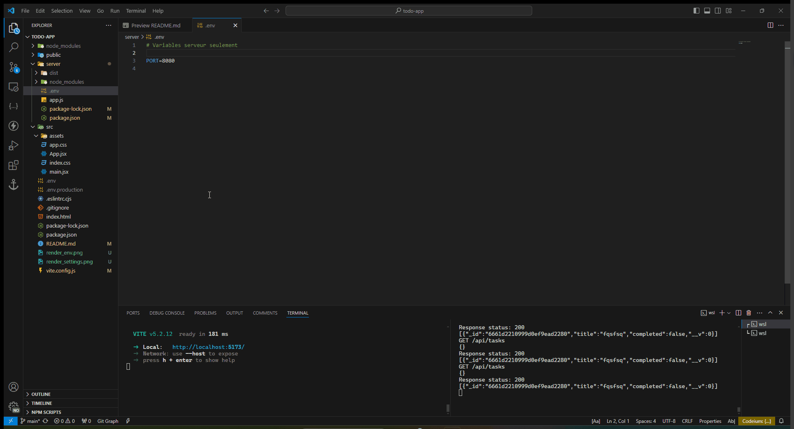

### Créer la base de données MongoDB Atlas

Dans cette partie on va utiliser les services de MongoDB Atlas pour créer la base de données NoSQL pour notre future application de "TODO List" et créer une collection de tâches.

Je vous invite à regarder les animations suivantes :

