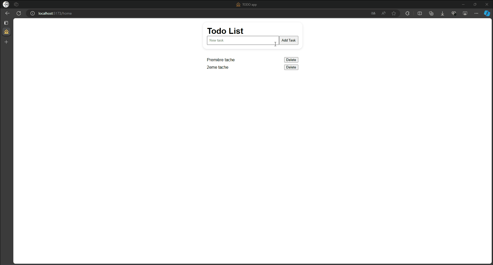

## Exercices

Après avoir suivit les tutoriels :
- [1_installer_mongodb_Express_React.md](1_installer_mongodb_Express_React.md)
- [2_mongodb_atlas.md](2_mongodb_atlas.md)
- [3_mongodb_mongosh.md](3_mongodb_mongosh.md)
- [4_backend_express-mongodb.md](4_backend_express-mongodb.md)

Il vous est demander de terminer les opérations de CRUD et de créer l'interface utilisateur pour gérer les tâches.

### 1. Dans votre application Express, terminer les opérations de CRUD et créer les routes nécessaires pour gérer les tâches :

1. Ajouter une nouvelle tâche
2. Lire toutes les tâches
3. Lire une seule tâche
4. Mettre à jour une tâche
5. Supprimer une tâche

### 2. Ajouter la partie frontend de l'application avec React.

Vous pouvez utiliser tailwindcss pour styliser l'application si vous le souhaitez.

### 3. Déployer l'application avec Render.

Voir le tutoriel [6_Render_deployer.md](6_Render_deployer.md)

## 4. Livrable

1. L'URL de votre repository GitHub
2. L'URL de votre application deployée sur Render

## Ressources utiles pout vous aider

- Apprendre les commandes MongoDB (requêtes) pour ajouter des tâches à la base de données MongoDB :

    <https://youtu.be/ofme2o29ngU?si=71NwVst-yrlySdRV>

- Opérations de CRUD avec MongoDB et Express :

    <https://youtu.be/ObkVmnr8B9k?si=_-eZJYsHxo0-Yabm>
