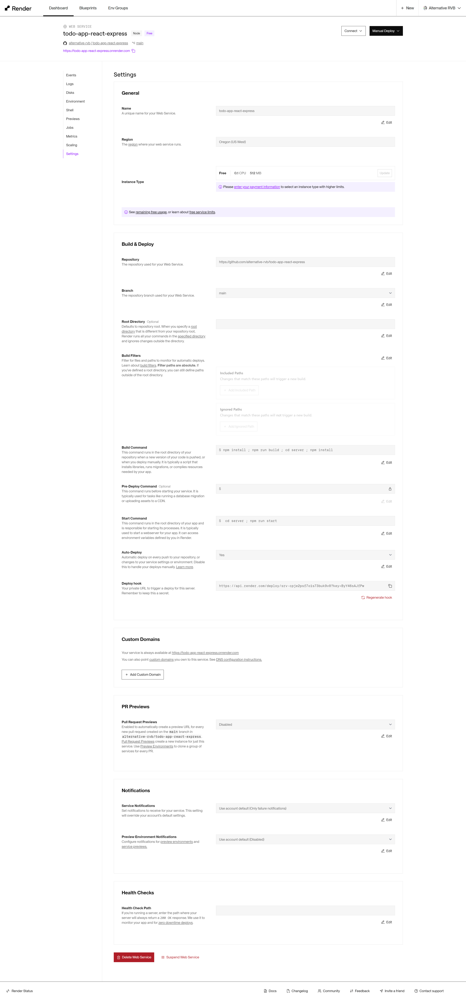
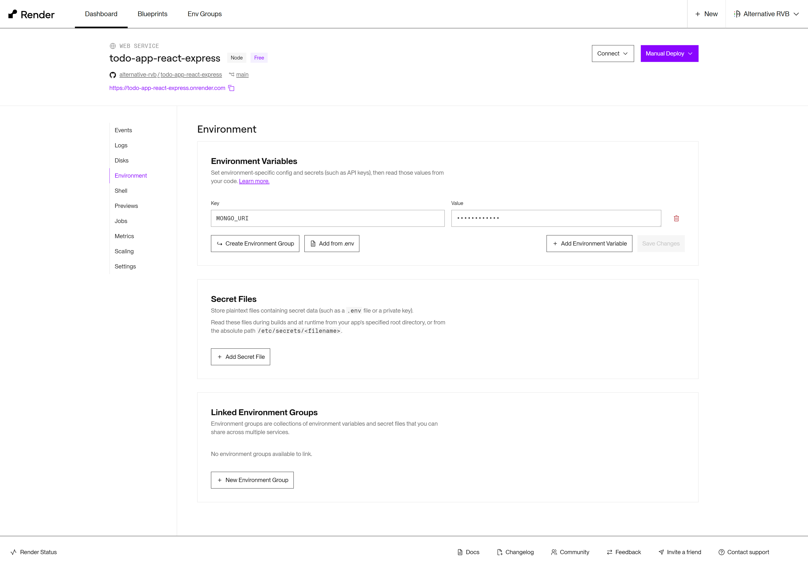

## Déployer votre application avec Render

Rendez-vous sur [Render](https://render.com/) : <https://render.com/>

1. Vous pouvez créer un compte rapidement en vous connectant avec les identifiants de votre compte GitHub
2. Choisissez +New > Web Service
3. Nommez votre projet et configuer les commandes nessaisaires pour deployer votre application.
    - Build Command: `npm install ; npm run build ; cd server ; npm install`
    - Start Command: `cd server ; npm run start`

